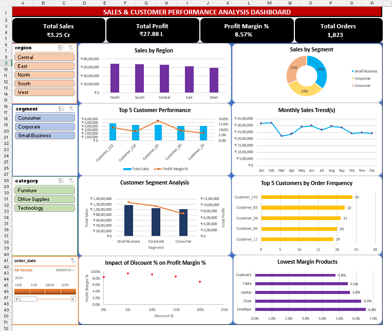

# Sales & Customer Performance Analysis

### Excel | PostgreSQL | Power Query | Sales Analytics

---

## Objective

To analyze sales performance, customer behavior, product profitability, and discount impact across 1,823 transactions using Excel (Power Query, Pivot Tables, Dashboard) and PostgreSQL — uncovering segment-level margin patterns and discount risk areas to generate targeted business recommendations.
---

## Tools & Technologies

| Tool                  | Purpose                                     |
| --------------------- | ------------------------------------------- |
| Microsoft Excel       | Data Analysis, Pivot Tables & Visualization |
| PostgreSQL            | Data Analysis & Querying                    |
| Power Query           | Data Cleaning & Transformation              |
| Pivot Tables & Charts | KPI Analysis & Business Reporting           |

---

## Skills Demonstrated

- Data Cleaning & Transformation
- Data Integration & Data Modeling
- Exploratory Data Analysis (EDA)
- Sales Performance Analysis
- Customer Segmentation Analysis
- Product Profitability Analysis
- SQL Querying & Data Aggregation
- Common Table Expressions (CTEs)
- Correlated Subqueries
- Window Functions & Ranking Analysis
- KPI Reporting & Dashboard Development
- Business Insight Generation
- Data Visualization & Storytelling

---

## Dataset Overview

* Transactions: 1,823 sales records
* Customers: 150
* Products: 15
* Categories: 3
* Regions: 5
* Domain: Retail Sales & Customer Analytics

---

## Data Preparation

* Consolidated three related source datasets into a unified analytical model
* Cleaned missing, invalid, and inconsistent records using Power Query
* Standardized date, numeric, and categorical fields
* Removed data quality issues affecting analysis accuracy
* Established relationships between customers, orders, and products
* Created a master analytical table for reporting and SQL analysis

---

## Analytical Approach

### Excel Analysis

* Built 15 Pivot Table analyses across sales, customer, and product dimensions
* Created interactive charts for trend, comparison, and profitability analysis
* Calculated KPI metrics for revenue, profit, customer performance, and margins
* Identified high-value customers, profitable products, and discount-risk areas
* Developed business-focused visual reports for decision support
* Interactive slicer-based dashboard

### PostgreSQL Analysis

* Performed sales, customer, product, and profitability analysis
* Applied joins, aggregation functions, filtering, and business segmentation
* Used Common Table Expressions (CTEs) for multi-step analysis
* Implemented window functions for ranking and comparative analysis
* Conducted Pareto-style customer and product contribution analysis
* Evaluated discount impact on profit margins and product performance
* Correlated subqueries for at-risk customer identification

---

 ## Dashboard Preview
### Sales & Customer Performance Dashboard

---

## Key Business Insights

1. Small Business led all segments with 9.30% profit margin vs Consumer's 7.14%
2. South ranked #1 in profit (₹6.49L) despite being #2 in sales — most efficient region
3. Discounts above 15% reduced profit margins by 2.35 percentage points vs the 5% discount tier
4. Sofa, Keyboard, Mouse generated ₹7.83L combined profit — 28% of total company profit
5. Customer_83 generated 18.3% margin vs company average of 8.57% — 2x more efficient

---

## Project Access

This repository showcases the project methodology, analytical approach, visual outputs, and business insights.
To preserve the originality of the work, the following assets are not publicly distributed:

* Source datasets
* Power Query transformation workflows
* Complete PostgreSQL query library
* Intermediate analytical files
* Calculation logic and supporting workbooks
* Detailed business recommendations

This repository is intended to demonstrate data cleaning, analytical thinking, SQL problem-solving, reporting design, and business insight generation.
Additional implementation details, technical decisions, and project walkthroughs can be discussed during interviews or portfolio reviews.

---

## 👤 Author

Victor Sarmacharjee  
Aspiring Data Analyst

[LinkedIn](https://www.linkedin.com/in/victorsa09/)
